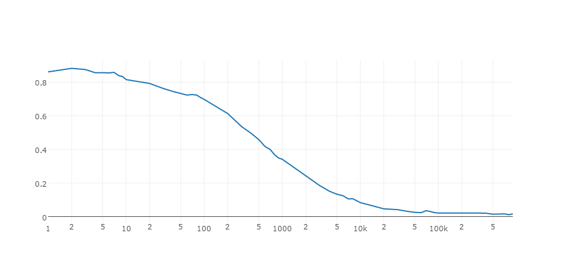

# Distributed-and-Asynchronos-SGD

This is a repository containing the fully distirbuted and asynchronos SGD. 

The main idea comes from a recent paper by Professor Mengdi Wang in Princeton: 
  Wang M, Chen Y, Liu J, et al. Random Multi-Constraint Projection: Stochastic Gradient Methods for Convex Optimization with Many Constraints[J]. arXiv preprint arXiv:1511.03760, 2015.

## Single Machine Mode

**distance from the current value of optimization varaible to ground truth**

**prediction error rate by current value of optimization variable**
(the error rate will be 0.9 by randomly guessing)

